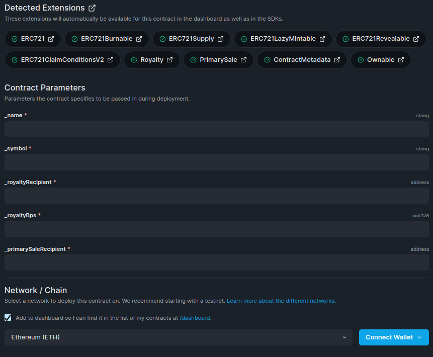
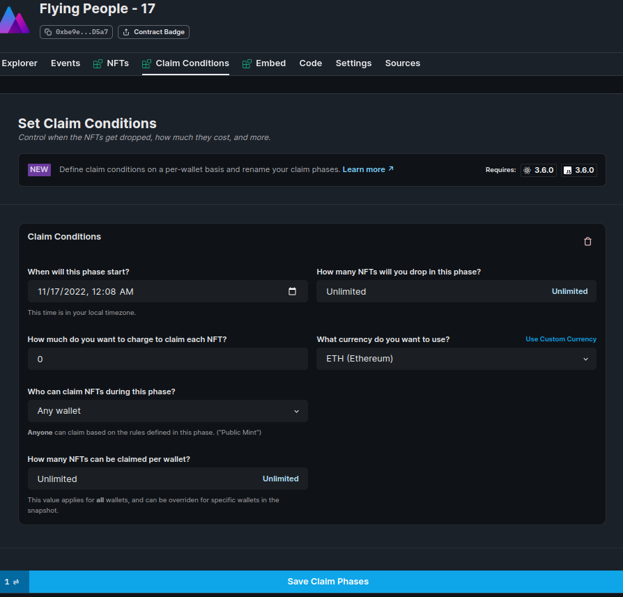
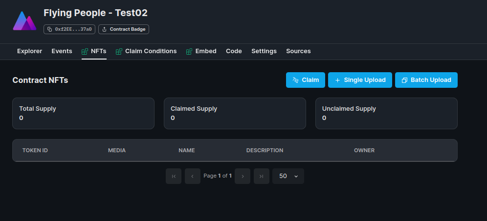
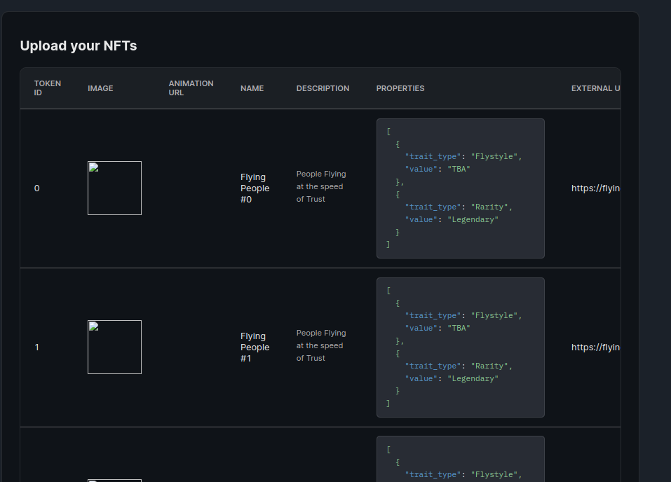

# Flying People DNFT Contracts.

This project uses hardhat and thirdweb/contractkit for development, testing, deployment and administration.

-   https://hardhat.org/
-   https://portal.thirdweb.com/contractkit


## Directory Structure

```bash
.
├── contracts
│   └── FlyingPeopleDNFT.sol # ERC721, DROP, ChainlinkClient
├── deploy
│   └── 01-deploy.js # Development deploy script
├── hardhat.config.js
├── helper-hardhat-config.js
├── metadata
│   └── batch-mint-fp-dnft.csv #Sample NFT batch mint
├── package.json
├── palmera.js
├── README.md
├── test
│   └── fp-nft.test.js # Development test script
└── yarn.lock
```

In the [metadata](./metadata/batch-mint-fp-dnft.csv) directory you can find the `batch-mint-fp-dnft.csv` to batch mint the collection NFTs.

NFT sample images are located in the [fp-dnft-api/public/fp-images/](../fp-dnft-api/public/fp-images/) project directory.

## Install dependencies

```bash
npm i
# or
yarn
```

## Building the project

Build Contracts

```bash
npm run build
# or
yarn build
```

# Deploying Contracts

When you're ready, run one of the following commands to deploy your contracts:

```bash
npm run deploy
# or
yarn deploy
```

The thirdweb sdk will compile, upload contract abi, and create a deployment link.
Follow the link to finish the deployment.

```
 💎 thirdweb-cli v0.8.16 💎

✔ Detected project type: hardhat
✔ Compilation successful
✔ Processing contract: "FlyingPeopleDNFT"
✔ Upload successful
✔ Open this link to deploy your contracts:
https://thirdweb.com/contracts/deploy/HASH
Done in 48.03s.
```

For this you will need a `metamask account` with `Goerli ETH`, this account will be the owner of the contract. Fill the constructor parameters and send the deployment transactions.

If you need Goerli ETH you can use the following faucet apps:

-   https://goerlifaucet.com/ (Alchemy)
-   https://faucets.chain.link/ (Chainlink)



When the transactions are confirmed you can review the deployed contract on your https://thirdweb.com/dashboard

You also can access directly on thirdweb using https://thirdweb.com/goerli/CONTRACT_ADDRESS

This will get you to the contract administration panel, using the same account used to deploy, you will get a tool to easly configure the NFT, set claim condition, mint NFTs, trigger contract transactions and [more](https://portal.thirdweb.com/).

# Configure claim conditions

Create at least one claim condition. Check the fields and set the conditions and claim price for the primary sale.



# Batch mint using batch-mint-fp-dnft.csv

Click on the NFTs tab and then click on the Batch Upload button



This will open a file input to load the `batch-mint-fp-dnft.csv`, check the list and start the batch mint transaction and IPFS metadata upload.



# All Done!

Now users can mint the collection NFTs. 

Check the [fp-dnft-app](../fp-dnft-app) directory, in this DApp users can `claim` an NFT and more.


